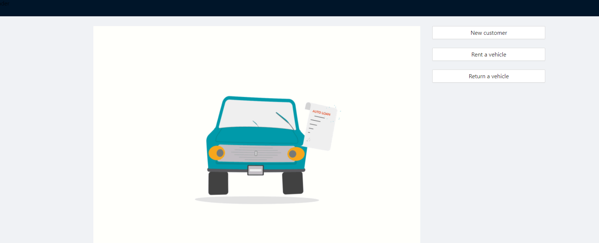
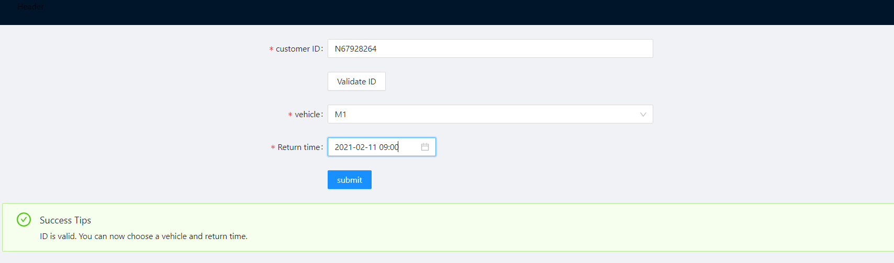
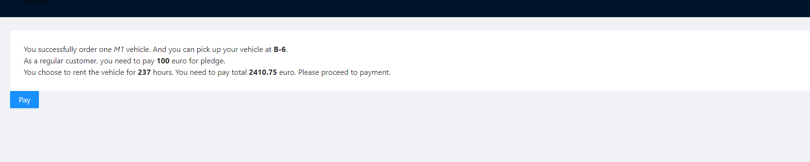
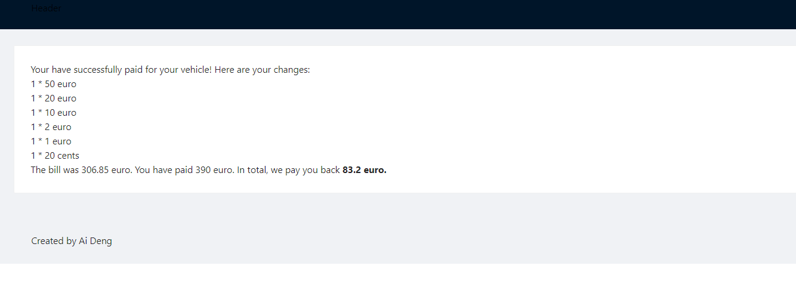
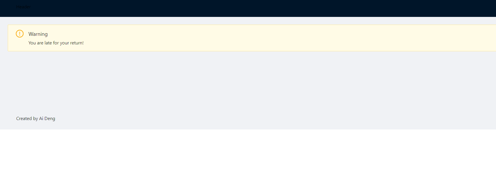
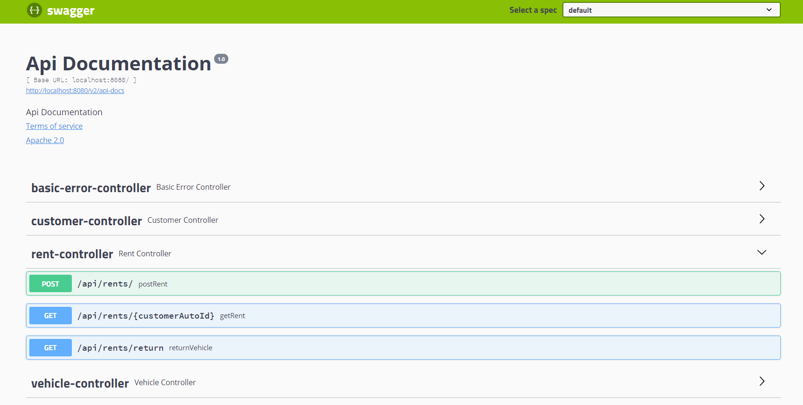

# RESTful (Spring boot + mysql + react js) webapp
## Demo






## Design Choices
This RESTful webapp is implemented with spring boot(backend)
and react js(frontend). All dependencies and versions can be 
found on _pom.xml_ in _CRSapp_ folder, e.g java 11. The system is persistent which
connects to a mysql database. The database is defined
in _CRSapp/src/main/resources/application.properties_. So make sure
you have your database running before you run and test the system.

The system has the following requirements fulfilled:
* Able to register as a customer and then get a customer ID
* Able to validate a customer ID
* If the input ID is valid and has no vehicle rented, the user
is able to rent an available vehicle
  * the rent starting time is set when the user submits the rent
    request(imagine it's a self machine at the airport)
  * the user is able to select a return time which up to hour. 
    The select time can't be earlier than today.
* After submit rent request, the user need to pay the pledge fee
and hour fees with notes and coins the user selected
* The system would cash back if there are changes
* The user can return the vehicle. The system is able to tell
if the return is delayed, if not the return is successful.
  * theoretically the drop off time should be the moment the user
    submit the return request. However, for test purpose, the return
    time is set as _the moment + 100 hours_. So if you rent a vehicle now
    and chose a return time that's 6 days after today, then you test the return 
    function, the system would tell you your return is successful.
    If you rent a vehicle and choose a return time that is tomorrow, then 
    you return the vehicle, the system would tell you the return is delayed.
    
Worth to mention, I used _swagger api_ to provide an API
documentation. So you could access http://localhost:8080/swagger-ui.html to see
all implemented endpoints after running the server. Also flyway migration is used
to document all changes of database table.
The running instruction are as followed:
## Spring Boot React CRUD
### Open Terminal
```cd react_front```
### Install NPM Dependencies 
```npm install```
### Start React 
```npm start```


### Open another Terminal
```cd CRSapp```
### Start SpringBoot Project 
```mvn spring-boot:run```
### Or Run This Project in any editor with normal process 

### Click bellow for backend API
http://localhost:8080/swagger-ui.html
You can see all API endpoints here


### Click bellow for frontend
http://localhost:3000
